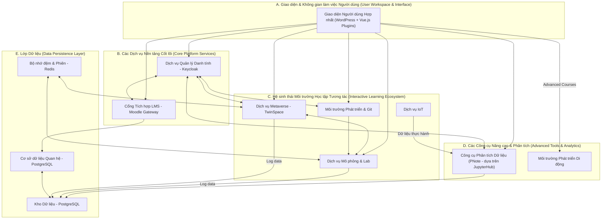
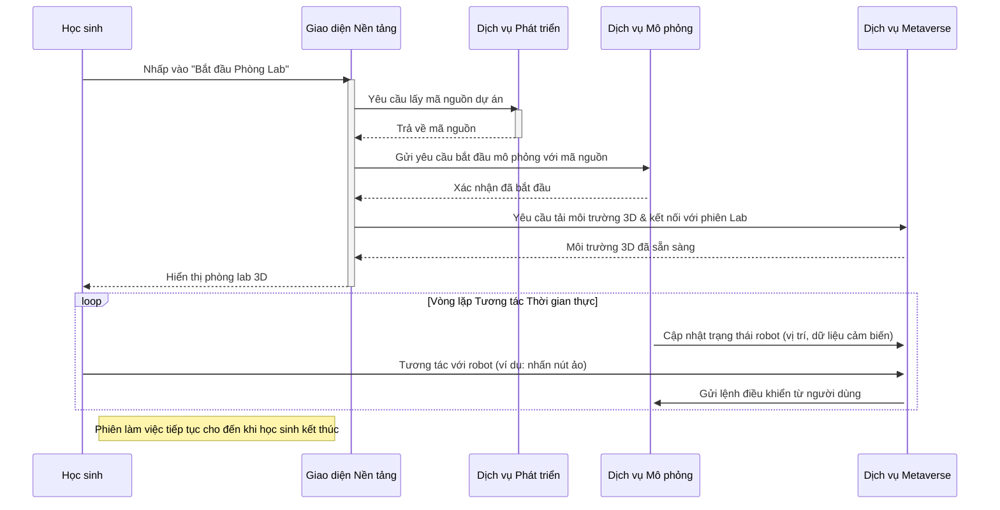
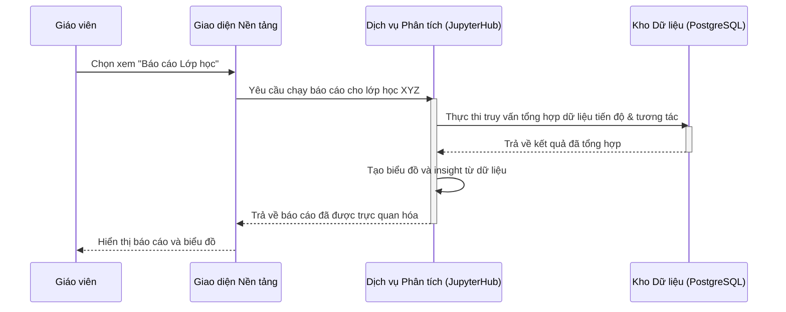

### **Tài liệu Kiến trúc Giải pháp (Solution Architecture Document)**

### **Nền tảng Giáo dục Pythaverse**

### **Phần 3: Tổng quan Giải pháp Khái niệm**

... (Các phần 3.1, 3.2 sẽ được thêm sau) ...

#### **3.3. Góc nhìn Logic & Quy trình (Logical & Process View)**

Phần này mô tả hệ thống từ hai góc độ: cấu trúc tĩnh của các thành phần (Góc nhìn Logic) và cách các thành phần này tương tác với nhau để thực hiện các chức năng chính (Góc nhìn Quy trình). Mục đích là để các bên liên quan, cả kinh doanh và kỹ thuật, hiểu được các khối xây dựng chính của hệ thống và cách chúng phối hợp hoạt động.

---

#### **3.3.1. Góc nhìn Logic (Logical View)**

Góc nhìn Logic phân rã toàn bộ hệ thống Pythaverse thành các khối chức năng chính (logical components) và các nhóm chức năng (functional groups). Sơ đồ này không thể hiện chi tiết về hạ tầng hay công nghệ triển khai, mà tập trung vào **trách nhiệm** của từng thành phần.

**Sơ đồ Phân rã Logic:**

**Mô tả các Thành phần Logic:**

* **A. Cổng Tương tác Người dùng:**  
  * **Giao diện Người dùng Hợp nhất (WordPress \+ Vue.js Plugins):** Đây là điểm truy cập chính. Nền tảng **WordPress** đóng vai trò là lớp vỏ (shell) chính. Các không gian làm việc (workspaces) và tính năng tương tác được phát triển dưới dạng các **plugin tùy chỉnh**. Mỗi plugin bao gồm một phần **frontend (Vue.js)** và một phần **backend (PHP Laravel)**, cung cấp trải nghiệm động và phong phú ngay bên trong WordPress.  
* **B. Các Dịch vụ Nền tảng Cốt lõi:**  
  * **Dịch vụ Quản lý Danh tính (IDM):** Hiện thực hóa bởi Keycloak, chịu trách nhiệm cho việc xác thực, phân quyền và SSO trên toàn bộ hệ sinh thái (đáp ứng BR1, FR1).  
  * **Cổng Tích hợp LMS (LMS Gateway):** Một microservice tùy chỉnh đóng vai trò là lớp trung gian, giao tiếp với Moodle để đồng bộ hóa danh sách lớp, lấy nội dung khóa học và đẩy điểm số (đáp ứng BR2, FR2).  
* **C. Hệ sinh thái Môi trường Học tập Tương tác:**  
  * Đây là trái tim của nền tảng, nơi diễn ra các hoạt động học tập thực hành.  
  * **Môi trường Phát triển & Git (Dev):** Cung cấp trình soạn thảo mã trên trình duyệt và tích hợp với GitBucket, cho phép học sinh viết mã và quản lý phiên bản (đáp ứng BR4, FR4).  
  * **Dịch vụ Mô phỏng & Lab (Lab):** Chịu trách nhiệm chạy các mô phỏng vật lý có độ trung thực cao, thực thi mã lệnh của robot và quản lý trạng thái của phòng lab ảo (đáp ứng BR5, FR5).  
  * **Dịch vụ Metaverse (Metaverse):** Hiện thực hóa bởi Mozilla Hubs, cung cấp không gian 3D, quản lý phòng ảo, hiển thị mô hình robot và các nhân vật AI. Đây là lớp trực quan hóa và cộng tác (đáp ứng BR3, FR3).  
  * **Dịch vụ IoT (IOT):** Tích hợp với OpenRemote, nhận dữ liệu từ các cảm biến vật lý (Leanbot) và cung cấp công cụ để học sinh tạo bảng điều khiển và quy tắc tự động hóa (đáp ứng BR6, FR6).  
* **D. Các Công cụ Nâng cao & Phân tích:**  
  * **Công cụ Phân tích Dữ liệu (PNote \- dựa trên JupyterHub):** Đây là một công cụ học tập dành cho học sinh. **PNote** cho phép học sinh mở các sổ ghi chép (notebooks) để thực hành các bài tập phân tích dữ liệu. Dữ liệu cho các bài thực hành này được lấy trực tiếp từ hệ thống **IoT**.  
  * **Môi trường Phát triển Di động (MobileDev):** Tích hợp MIT App Inventor, cung cấp một môi trường lập trình khối để học sinh tạo các ứng dụng di động (đáp ứng BR8, FR8).  
* **E. Lớp Dữ liệu:**  
  * **CSDL Quan hệ (RDB):** Sử dụng PostgreSQL, là nơi lưu trữ chính cho dữ liệu có cấu trúc như thông tin người dùng, khóa học, điểm số (đáp ứng BR10, FR10.1).  
  * **Bộ nhớ đệm & Phiên (Cache):** Sử dụng Redis để lưu trữ dữ liệu truy cập thường xuyên và quản lý trạng thái phiên thời gian thực trong các tương tác 3D, giúp giảm độ trễ (đáp ứng FR10.2).  
  * **Kho Dữ liệu (DWH):** Sử dụng PostgreSQL, là nơi tổng hợp dữ liệu từ các dịch vụ khác nhau để phục vụ cho mục đích phân tích và báo cáo (đáp ứng FR10.3).

---

#### **3.3.2. Góc nhìn Quy trình (Process View)**

Góc nhìn Quy trình minh họa cách các thành phần logic tương tác với nhau theo thời gian để hoàn thành các kịch bản sử dụng quan trọng. Chúng ta sẽ sử dụng Sơ đồ Tuần tự (Sequence Diagram) để thể hiện các luồng này.

**1\. Quy trình: Học sinh Bắt đầu một Buổi thực hành Lập trình Robot**

Đây là quy trình cốt lõi, thể hiện vòng lặp tương tác thời gian thực của nền tảng.

* **Mô tả:** Học sinh khởi tạo một phiên lab từ giao diện. Giao diện lấy mã nguồn từ dịch vụ Dev và yêu cầu dịch vụ Lab bắt đầu một mô phỏng. Đồng thời, nó yêu cầu dịch vụ Metaverse tải lên không gian 3D tương ứng. Sau đó, một vòng lặp thời gian thực được thiết lập: Lab liên tục gửi dữ liệu trạng thái để Metaverse hiển thị, và Metaverse gửi lại các lệnh tương tác của người dùng để Lab cập nhật mô phỏng.

**2\. Quy trình: Giáo viên xem Báo cáo Phân tích Lớp học**

Quy trình này minh họa luồng dữ liệu phân tích từ các hệ thống con đến tay người dùng.

* **Mô tả:** Giáo viên yêu cầu xem báo cáo từ giao diện. Yêu cầu này được chuyển đến dịch vụ Analytics. Dịch vụ Analytics sẽ chạy các truy vấn đã được định sẵn trên Kho Dữ liệu (DWH), nơi tổng hợp dữ liệu từ nhiều nguồn. Sau khi nhận và xử lý dữ liệu, nó tạo ra các biểu đồ và gửi lại cho giao diện để hiển thị cho giáo viên.
