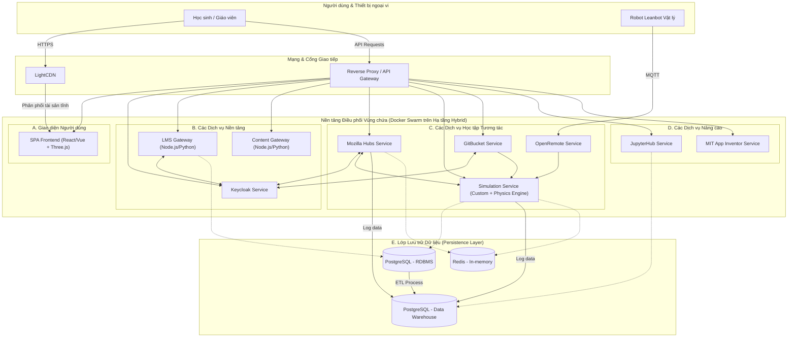

### **Tài liệu Kiến trúc Giải pháp (Solution Architecture Document)**

### **Nền tảng Giáo dục Pythaverse** 

### **Phần 3: Tổng quan Giải pháp Khái niệm**

... (Các phần trước) ...

#### **3.4. Góc nhìn Triển khai thực tế (Implementation View)**

Góc nhìn này đi sâu vào các lựa chọn kiến trúc và công nghệ cụ thể sẽ được sử dụng để xây dựng nền tảng Pythaverse. Nó cung cấp bản thiết kế chi tiết cho đội ngũ phát triển, DevOps và vận hành, lý giải "cái gì" và "tại sao" đằng sau mỗi lựa chọn.

---

#### **3.4.1. Lựa chọn Mẫu Kiến trúc: Microservices**

Dựa trên các yêu cầu về khả năng mở rộng, bảo trì và triển khai độc lập (NFR4, NFR12), nền tảng sẽ được xây dựng dựa trên mẫu kiến trúc **Microservices**.

* **Lý do lựa chọn:**  
  * **Khả năng mở rộng độc lập:** Mỗi dịch vụ (ví dụ: Dịch vụ Mô phỏng, Dịch vụ Metaverse) có thể được mở rộng quy mô một cách độc lập dựa trên nhu cầu tải thực tế, giúp tối ưu hóa việc sử dụng tài nguyên (NFR5).  
  * **Tăng cường khả năng bảo trì:** Các đội nhóm nhỏ có thể tập trung phát triển và bảo trì một hoặc một vài dịch vụ, giúp đơn giản hóa quy trình và tăng tốc độ phát triển (NFR12).  
  * **Linh hoạt về công nghệ:** Mỗi microservice có thể được xây dựng bằng ngăn xếp công nghệ phù hợp nhất cho chức năng của nó (ví dụ: Node.js cho các dịch vụ I/O-intensive, Python cho các tác vụ AI/dữ liệu).  
  * **Tăng cường độ tin cậy:** Lỗi ở một dịch vụ ít có khả năng làm sập toàn bộ hệ thống, giúp cải thiện thời gian hoạt động và khả năng tự phục hồi (NFR10).

---

#### **3.4.2. Sơ đồ Kiến trúc Hệ thống Tổng thể**

Sơ đồ dưới đây minh họa cách các thành phần công nghệ cụ thể tương tác với nhau trong một môi trường triển khai thực tế.

---

#### **3.4.3. Phân rã Dịch vụ và Ngăn xếp Công nghệ (Technology Stack)**

Bảng dưới đây ánh xạ các thành phần logic từ Phần 3.3 sang các microservice/ứng dụng cụ thể và ngăn xếp công nghệ được sử dụng.

| Thành phần Logic | Dịch vụ / Ứng dụng | Ngăn xếp Công nghệ (Technology Stack) | Trách nhiệm chính |
| :---- | :---- | :---- | :---- |
| **Giao diện Người dùng** | wordpress-platform | **WordPress (PHP)**, Plugin tùy chỉnh với **Vue.js** (Frontend) & **PHP Laravel** (Backend) | Cung cấp giao diện hợp nhất, hiển thị môi trường 3D, quản lý trạng thái phía client. |
| **Quản lý Danh tính** | Keycloak Service | **Keycloak**, PostgreSQL | Quản lý người dùng, vai trò, quyền; cung cấp SSO, tích hợp LDAP/SAML. (FR1) |
| **Cổng Tích hợp LMS** | lms-gateway-service | **Node.js/Python**, REST API | Làm lớp trung gian giao tiếp với Moodle API, đồng bộ dữ liệu lớp học và điểm số. (FR2) |
| **Môi trường Phát triển** | GitBucket Service | **GitBucket**, Java, Git | Cung cấp kho chứa Git riêng cho mỗi dự án, quản lý phiên bản mã nguồn. (FR4) |
| **Dịch vụ Mô phỏng** | simulation-service | Dịch vụ tùy chỉnh (Node.js/Python), Physics Engine, WebSockets | Chạy mô phỏng vật lý, thực thi mã lệnh robot, quản lý trạng thái phòng lab. (FR5) |
| **Dịch vụ Metaverse** | Mozilla Hubs Service | **Mozilla Hubs**, Node.js, WebRTC, A-Frame, OpenAI API, RAG | Quản lý phòng ảo 3D, avatar, tương tác đa người dùng, tích hợp và điều khiển các nhân vật AI. (FR3) |
| **Dịch vụ IoT** | OpenRemote Service | **OpenRemote**, Java, MQTT | Nhận, xử lý và cung cấp công cụ trực quan hóa dữ liệu từ các cảm biến IoT. (FR6) |
| **Dịch vụ Phân tích** | JupyterHub Service | **JupyterHub**, Python, Pandas, Matplotlib | Cung cấp môi trường sổ ghi chép tương tác để phân tích dữ liệu từ DWH. (FR7) |
| **Phát triển Di động** | MIT App Inventor Service | **MIT App Inventor**, Java | Cung cấp môi trường lập trình khối để xây dựng ứng dụng di động. (FR8) |

---

#### **3.4.4. Lựa chọn Công nghệ Nền tảng**

Các công nghệ này đóng vai trò là nền móng, hỗ trợ cho toàn bộ các microservice.

* **Containerization & Orchestration:**  
  * **Công nghệ:** **Docker** và **Docker Swarm**.  
  * **Lý do:** Tất cả các microservice sẽ được đóng gói trong các container Docker để đảm bảo tính nhất quán giữa các môi trường (FR11.2). Docker Swarm được chọn làm công cụ điều phối để tự động hóa việc triển khai, mở rộng quy mô và tự phục hồi các dịch vụ, đảm bảo tính sẵn sàng cao (FR11.3, NFR10).  
* **Cơ sở dữ liệu:**  
  * **Công nghệ:** **PostgreSQL** và **Redis**.  
  * **Lý do:** PostgreSQL được sử dụng cho hai mục đích: làm CSDL quan hệ chính (RDBMS) cho dữ liệu có cấu trúc và làm Kho Dữ liệu (DWH) cho việc phân tích (FR10.1, FR10.3). Redis được sử dụng làm bộ nhớ đệm (caching) và quản lý phiên (session management) cho các dịch vụ đòi hỏi tốc độ cao như Mô phỏng và Metaverse, giúp giảm độ trễ (FR10.2).  
* **Tích hợp và Triển khai Liên tục (CI/CD):**  
  * **Công nghệ:** **GitHub Actions**.  
  * **Lý do:** Sử dụng GitHub Actions để xây dựng một quy trình CI/CD hoàn toàn tự động. Mỗi khi có commit mới vào nhánh chính, quy trình sẽ tự động chạy kiểm thử, xây dựng Docker image và triển khai lên môi trường Docker Swarm, giúp giảm thiểu lỗi con người và tăng tốc độ phát hành (FR11.4, NFR13).  
* **Mạng & Phân phối Nội dung:**  
  * **Công nghệ:** **Reverse Proxy** (ví dụ: Nginx, Traefik) và **LightCDN**.  
  * **Lý do:** Một Reverse Proxy sẽ đóng vai trò là điểm vào duy nhất cho tất cả các yêu cầu từ bên ngoài, chịu trách nhiệm định tuyến đến các microservice phù hợp, cân bằng tải và xử lý SSL. LightCDN sẽ được sử dụng để lưu trữ và phân phối các tài sản tĩnh (JS, CSS, hình ảnh, model 3D), giúp giảm thời gian tải trang và cải thiện trải nghiệm người dùng trên toàn cầu (FR11.5, NFR3).

