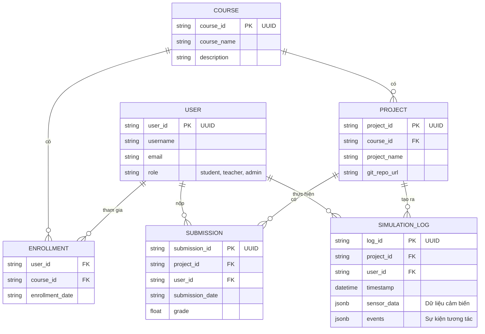
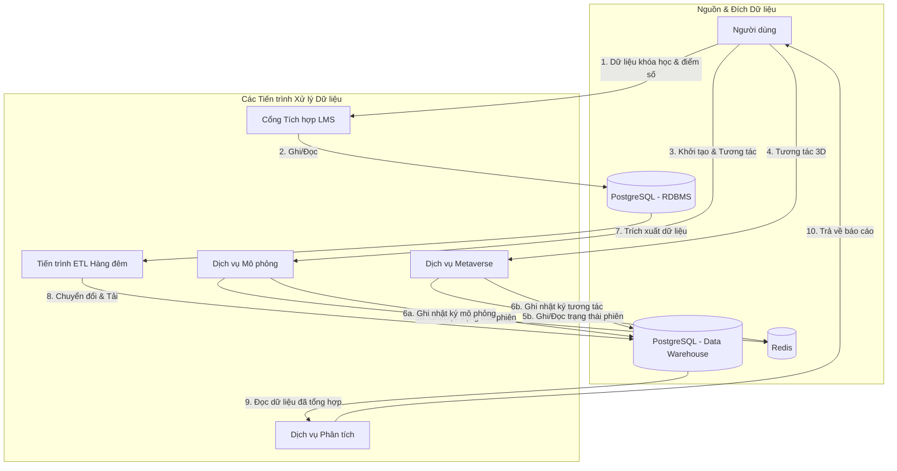
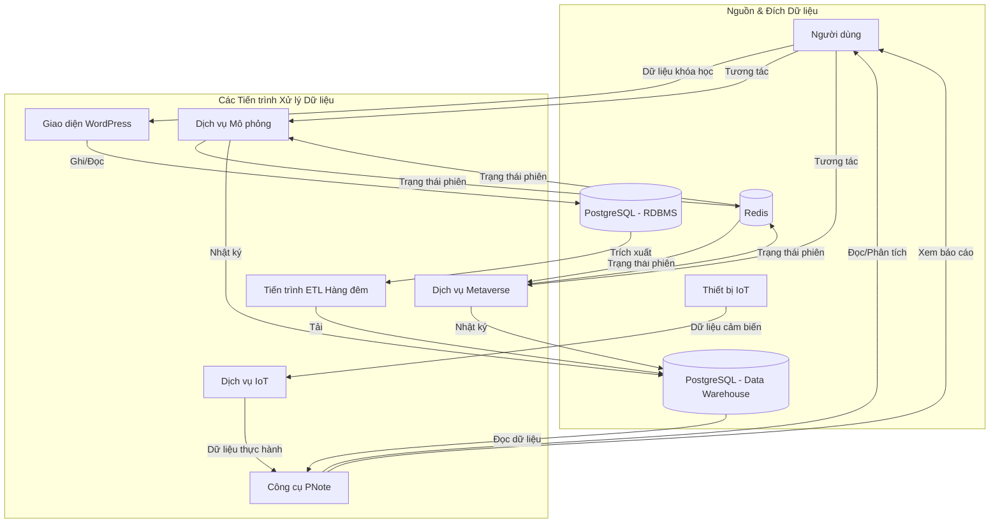

### **Tài liệu Kiến trúc Giải pháp (Solution Architecture Document)**

### **Nền tảng Giáo dục Pythaverse SWRP**

### **Phần 3: Tổng quan Giải pháp Khái niệm**

... (Các phần trước) ...

#### **3.5. Góc nhìn Dữ liệu (Data View)**

Góc nhìn này tập trung vào kiến trúc dữ liệu của nền tảng, mô tả cách dữ liệu được cấu trúc, lưu trữ, quản lý và di chuyển trong toàn bộ hệ sinh thái. Nó đảm bảo tính toàn vẹn, bảo mật và khả dụng của dữ liệu cho tất cả các dịch vụ.

---

#### **3.5.1. Mô hình Dữ liệu Khái niệm (Conceptual Data Model)**

Mô hình này mô tả các thực thể dữ liệu chính và mối quan hệ giữa chúng ở mức độ cao.

**Sơ đồ Quan hệ Thực thể (ERD \- Entity Relationship Diagram):**

**Mô tả các Thực thể chính:**

* **USER:** Lưu trữ thông tin cơ bản về tất cả người dùng, được quản lý tập trung bởi Keycloak và đồng bộ hóa với CSDL chính.  
* **COURSE:** Đại diện cho một khóa học trong Moodle, bao gồm tên và mô tả.  
* **ENROLLMENT:** Bảng liên kết, cho biết học sinh nào đã ghi danh vào khóa học nào.  
* **PROJECT:** Đại diện cho một dự án hoặc bài tập lớn trong một khóa học, có liên kết đến một kho chứa Git.  
* **SUBMISSION:** Lưu trữ thông tin về việc nộp bài của học sinh cho một dự án, bao gồm điểm số cuối cùng.  
* **SIMULATION\_LOG:** **Đây là thực thể dữ liệu lớn nhất**, ghi lại chi tiết các sự kiện và dữ liệu cảm biến từ mỗi phiên mô phỏng của học sinh. Dữ liệu này là đầu vào cho Kho Dữ liệu.

---

#### **3.5.2. Luồng Dữ liệu (Data Flow Diagram \- DFD)**

Sơ đồ này minh họa cách dữ liệu di chuyển giữa các thành phần chính của hệ thống.

**Giải thích Luồng Dữ liệu:**

1. **Dữ liệu học vụ:** Người dùng (giáo viên) nhập dữ liệu khóa học và điểm số thông qua Cổng LMS.  
2. **Lưu trữ chính:** Cổng LMS ghi và đọc dữ liệu này từ CSDL quan hệ chính (RDB).  
3. & **4\. Dữ liệu tương tác:** Người dùng tương tác với các dịch vụ Lab và Metaverse, tạo ra một lượng lớn dữ liệu sự kiện và trạng thái.  
4. **Lưu trữ tạm thời (Cache):** Để đảm bảo hiệu suất thời gian thực, cả Lab và Metaverse đều sử dụng Redis Cache để đọc/ghi nhanh chóng trạng thái của phiên làm việc (vị trí robot, hành động của người dùng).  
5. **Ghi nhật ký (Logging):** Đồng thời, Lab và Metaverse ghi lại một bản sao đầy đủ và chi tiết của tất cả các sự kiện và dữ liệu cảm biến vào Kho Dữ liệu (DWH) để phân tích sau này.  
6. & **8\. Tiến trình ETL:** Một tiến trình tự động (ETL) chạy định kỳ (ví dụ: hàng đêm) để trích xuất dữ liệu từ CSDL chính (như thông tin người dùng, khóa học), chuyển đổi và tải vào Kho Dữ liệu, làm giàu thêm dữ liệu đã có.  
7. & **10\. Phân tích và Báo cáo:** Dịch vụ Analytics truy vấn dữ liệu đã được làm sạch và tổng hợp trong DWH để tạo ra các báo cáo và insight, sau đó hiển thị cho người dùng (giáo viên).

---

#### **3.5.3. Chiến lược Lưu trữ Dữ liệu**

Hệ thống sử dụng một kiến trúc lưu trữ đa tầng để đáp ứng các nhu cầu khác nhau về hiệu suất, tính nhất quán và phân tích.

* **PostgreSQL (RDBMS \- Cơ sở dữ liệu Giao dịch):**  
  * **Mục đích:** Là "nguồn sự thật duy nhất" cho các dữ liệu quan trọng, có cấu trúc cao như thông tin người dùng, khóa học, điểm số, và các cấu hình hệ thống.  
  * **Lý do:** Đảm bảo các thuộc tính **ACID** (Atomicity, Consistency, Isolation, Durability), cần thiết cho tính toàn vẹn của dữ liệu học vụ.  
  * **Yêu cầu đáp ứng:** BR10, FR10.1, NFR18.  
* **Redis (In-Memory Data Store \- Bộ nhớ đệm):**  
  * **Mục đích:** Lưu trữ các dữ liệu tạm thời, có vòng đời ngắn nhưng yêu cầu tốc độ truy xuất cực nhanh. Ví dụ: trạng thái hiện tại của một phiên mô phỏng, thông tin phiên đăng nhập của người dùng.  
  * **Lý do:** Giảm tải cho CSDL chính và đáp ứng yêu cầu về độ trễ thấp cho các tương tác thời gian thực trong Metaverse và Lab.  
  * **Yêu cầu đáp ứng:** FR10.2, NFR1.  
* **PostgreSQL (Data Warehouse \- Kho Dữ liệu):**  
  * **Mục đích:** Là nơi lưu trữ tập trung, lâu dài cho một khối lượng lớn dữ liệu lịch sử và nhật ký sự kiện từ nhiều dịch vụ khác nhau. Dữ liệu ở đây được tối ưu hóa cho việc đọc và truy vấn phức tạp.  
  * **Lý do:** Tách biệt khối lượng công việc phân tích (đọc nhiều, phức tạp) khỏi khối lượng công việc giao dịch (ghi/đọc nhanh, đơn giản), đảm bảo cả hai hệ thống đều hoạt động hiệu quả.  
  * **Yêu cầu đáp ứng:** FR7.2, FR10.3.

---

#### **3.5.4. Bảo mật và Tính toàn vẹn Dữ liệu**

* **Mã hóa:** Tất cả dữ liệu nhạy cảm (thông tin cá nhân của học sinh) phải được mã hóa cả khi đang truyền (at-rest) và khi được lưu trữ (in-transit) bằng các thuật toán mã hóa mạnh (NFR6).  
* **Phân quyền truy cập:** Quyền truy cập vào cơ sở dữ liệu sẽ được kiểm soát chặt chẽ ở cấp độ ứng dụng. Các dịch vụ chỉ được cấp quyền truy cập vào các schema hoặc bảng dữ liệu mà chúng cần.  
* **Sao lưu và Phục hồi:** Một chiến lược sao lưu tự động sẽ được thiết lập cho cả RDBMS và DWH, với các bản sao lưu được lưu trữ ở một vị trí địa lý khác để đảm bảo khả năng phục hồi sau thảm họa (Disaster Recovery) (NFR19).

