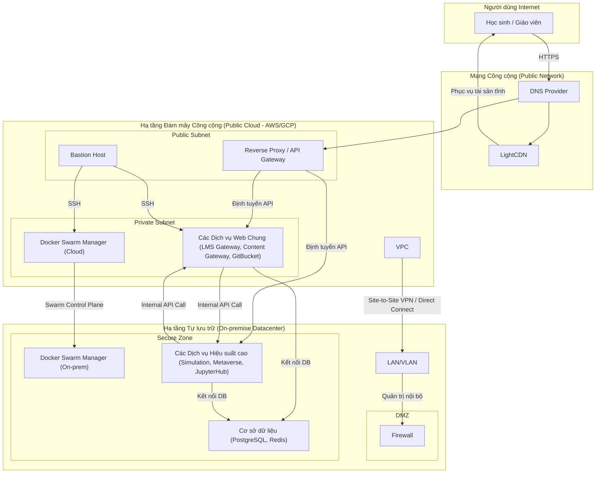
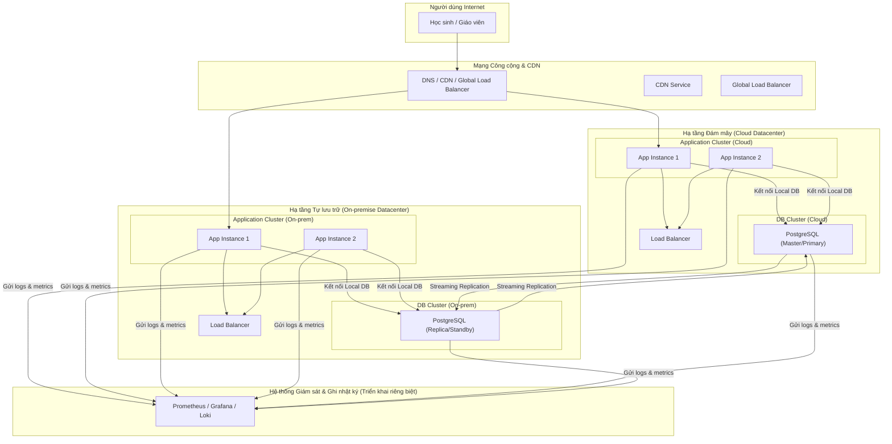

### **Tài liệu Kiến trúc Giải pháp (Solution Architecture Document)**

### **Nền tảng Giáo dục Pythaverse SWRP**

### **Phần 3: Tổng quan Giải pháp Khái niệm**

... (Các phần trước) ...

#### **3.6. Góc nhìn Triển khai & Vận hành (Deployment & Operational View)**

Góc nhìn này mô tả kiến trúc hạ tầng vật lý (hoặc ảo hóa), cách các thành phần phần mềm được triển khai lên hạ tầng đó, và các quy trình cần thiết để duy trì, giám sát và đảm bảo hệ thống hoạt động ổn định, hiệu quả.

---

#### **3.6.1. Kiến trúc Triển khai (Deployment Architecture)**

Nền tảng được triển khai theo mô hình **Hybrid (Lai)**, kết hợp giữa hạ tầng tự lưu trữ (On-premise) và đám mây công cộng (Public Cloud) để tận dụng tối đa ưu điểm của cả hai.

**Sơ đồ Kiến trúc Triển khai:**

**Lý do lựa chọn mô hình Hybrid (FR11.1):**

* **Hạ tầng Tự lưu trữ (On-premise):**  
  * **Mục đích:** Dành cho các thành phần đòi hỏi hiệu suất tính toán cao, độ trễ mạng cực thấp giữa các dịch vụ, hoặc có yêu cầu bảo mật dữ liệu nghiêm ngặt.  
  * **Các thành phần đặt tại đây:** Dịch vụ Mô phỏng, Dịch vụ Metaverse, JupyterHub, và toàn bộ cụm Cơ sở dữ liệu.  
  * **Lợi ích:** Tối ưu hóa hiệu suất, giảm chi phí truyền dữ liệu (data egress), và toàn quyền kiểm soát an ninh dữ liệu.  
* **Hạ tầng Đám mây Công cộng (Public Cloud):**  
  * **Mục đích:** Dành cho các thành phần cần đối mặt trực tiếp với Internet, tận dụng khả năng mở rộng linh hoạt và các dịch vụ quản lý sẵn có.  
  * **Các thành phần đặt tại đây:** Reverse Proxy, API Gateway, và các dịch vụ web chung không yêu cầu tính toán quá nặng.  
  * **Lợi ích:** Khả năng mở rộng theo yêu cầu, độ tin cậy cao của các dịch vụ mạng, và giảm gánh nặng quản trị hạ tầng mạng ngoại vi.

---

#### **3.6.2. Quy trình Tích hợp và Triển khai Liên tục (CI/CD Pipeline)**

Quy trình CI/CD được tự động hóa hoàn toàn bằng **GitHub Actions** để đảm bảo việc triển khai nhanh chóng, nhất quán và an toàn (FR11.4, NFR13).

**Luồng CI/CD cho một Microservice:**

1. **Commit Code:** Nhà phát triển đẩy mã nguồn mới lên một nhánh feature trên kho chứa GitHub.  
2. **Pull Request:** Tạo một Pull Request để sáp nhập vào nhánh main.  
3. **CI \- Giai đoạn Tích hợp (Chạy tự động):**  
   * **Code Linting & Static Analysis:** Kiểm tra chất lượng và phong cách mã nguồn.  
   * **Unit & Integration Tests:** Chạy các bộ kiểm thử tự động.  
   * **Build Docker Image:** Nếu tất cả kiểm thử thành công, quy trình sẽ xây dựng một Docker image mới cho dịch vụ và đẩy lên một kho chứa image riêng (ví dụ: Docker Hub, AWS ECR).  
4. **Code Review & Merge:** Pull Request được các thành viên khác trong nhóm xem xét và phê duyệt. Sau khi sáp nhập vào nhánh main, quy trình CD được kích hoạt.  
5. **CD \- Giai đoạn Triển khai (Chạy tự động):**  
   * **Deploy to Staging:** GitHub Actions kết nối đến cụm Docker Swarm (môi trường Staging) và ra lệnh cập nhật dịch vụ với image mới bằng phương thức triển khai không downtime (rolling update).  
   * **Automated E2E Tests:** Chạy các kịch bản kiểm thử End-to-End tự động trên môi trường Staging.  
   * **(Bước thủ công) Promote to Production:** Sau khi xác nhận môi trường Staging hoạt động ổn định, một người có thẩm quyền (ví dụ: Tech Lead) sẽ kích hoạt quy trình triển khai lên môi trường Production.  
   * **Deploy to Production:** Quy trình lặp lại việc cập nhật dịch vụ trên cụm Production.

---

#### **3.6.3. Giám sát và Cảnh báo (Monitoring & Alerting)**

Để đảm bảo hệ thống hoạt động ổn định và đáp ứng SLA 99.9%, một hệ thống giám sát toàn diện sẽ được thiết lập (NFR9).

* **Công cụ (Gợi ý):** Bộ công cụ **Prometheus \+ Grafana \+ Alertmanager**.  
* **Các lớp Giám sát:**  
  * **Giám sát Hạ tầng (Infrastructure Monitoring):**  
    * **Chỉ số:** Mức sử dụng CPU, RAM, Disk I/O, Network của các máy chủ vật lý và ảo hóa.  
    * **Mục đích:** Phát hiện sớm các vấn đề về tài nguyên phần cứng.  
  * **Giám sát Nền tảng (Platform Monitoring):**  
    * **Chỉ số:** Tình trạng của cụm Docker Swarm, số lượng container đang chạy, số lần restart của các dịch vụ.  
    * **Mục đích:** Đảm bảo nền tảng điều phối hoạt động ổn định.  
  * **Giám sát Ứng dụng (Application Performance Monitoring \- APM):**  
    * **Chỉ số (phương pháp RED):** **R**ate (số lượng yêu cầu/giây), **E**rrors (tỷ lệ lỗi), **D**uration (độ trễ phản hồi của các API).  
    * **Mục đích:** Đây là lớp giám sát quan trọng nhất, cho biết sức khỏe thực tế của từng microservice từ góc nhìn của người dùng.  
* **Cảnh báo (Alerting):**  
  * Alertmanager sẽ được cấu hình để gửi cảnh báo tự động đến các kênh phù hợp (ví dụ: Slack, PagerDuty, Email) khi một trong các chỉ số giám sát vượt ngưỡng đã định sẵn.  
  * **Ví dụ về quy tắc cảnh báo:** "Nếu tỷ lệ lỗi của lms-gateway-service vượt quá 5% trong vòng 5 phút, gửi cảnh báo mức độ critical đến kênh Slack \#devops-alerts."

---

#### **3.6.4. Sao lưu và Phục hồi sau Thảm họa (Backup & Disaster Recovery)**

* **Sao lưu (Backup):**  
  * **Đối tượng:** Cơ sở dữ liệu PostgreSQL (cả RDBMS và DWH).  
  * **Chiến lược:**  
    * **Full Backup:** Thực hiện sao lưu toàn bộ cơ sở dữ liệu hàng tuần.  
    * **Incremental Backup:** Thực hiện sao lưu các thay đổi hàng ngày.  
    * **WAL Archiving (Point-in-Time Recovery):** Lưu trữ liên tục các bản ghi giao dịch, cho phép khôi phục lại trạng thái của CSDL tại bất kỳ thời điểm nào.  
  * **Lưu trữ:** Các bản sao lưu sẽ được mã hóa và lưu trữ trên một dịch vụ lưu trữ đám mây (ví dụ: AWS S3), đảm bảo an toàn và tách biệt về mặt địa lý (NFR19).  
* **Phục hồi sau Thảm họa (Disaster Recovery Plan):**  
  * Một tài liệu chi tiết về kế hoạch DR sẽ được xây dựng, mô tả các bước cần thực hiện để khôi phục lại toàn bộ hệ thống trong trường hợp xảy ra thảm họa ở trung tâm dữ liệu chính.  
  * Kế hoạch này sẽ được kiểm thử định kỳ (ví dụ: 6 tháng/lần) để đảm bảo tính hiệu quả và sự quen thuộc của đội ngũ vận hành.  
  * **Mục tiêu:** Đáp ứng các chỉ số RTO (Recovery Time Objective \- thời gian tối đa để khôi phục) và RPO (Recovery Point Objective \- lượng dữ liệu mất tối đa) đã được thống nhất.
